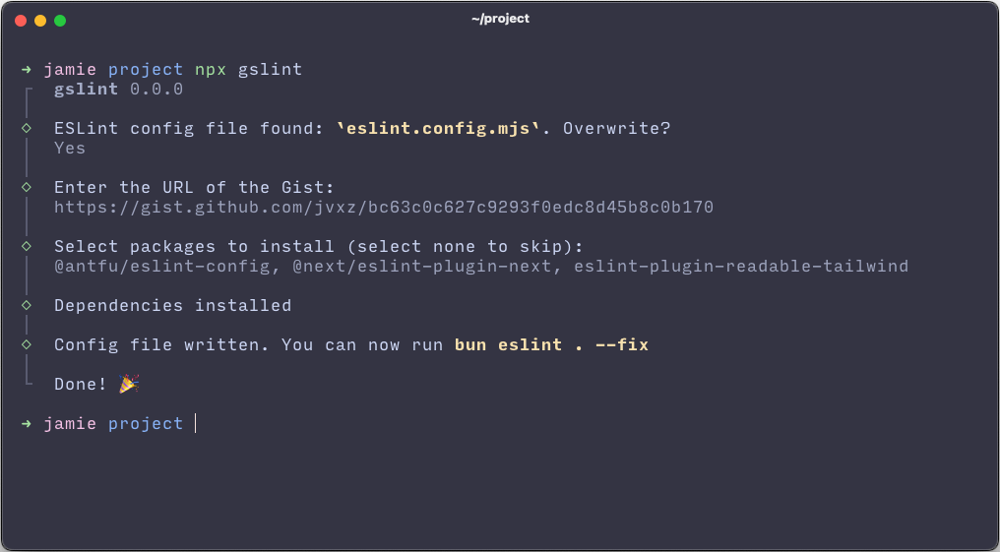

<h1>gslint</h1>

<p>Easily create an ESLint config from a GitHub Gist.</p>

## Features

- Automatic dependency detection + installation
- ESLint config file detection
- Manual override via CLI args

## Usage

```bash
npx gslint # Initiate the wizard
npx gslint --yes # Skip Node.js project and commit warnings
npx gslint --package-manager npm # Manually specify package manager (in this case, npm)
npx gslint --gist https://gist.github.com/... # Provide Gist to use for the config
npx gslint --help # Display information about the CLI
```

## Example

<p align="center">
  
</p>

## License

MIT 2025 [@jvxz](https://github.com/jvxz)
